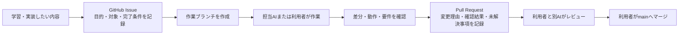

# AI協働の役割分担とGitHub運用

## 1. 目的

この資料は、タスク管理アプリの学習・開発で Codex、Claude Code、GitHub Copilot を併用する際に、担当範囲とGitHub上の連携方法を明確にする。

AIが出した内容は必ず利用者が確認し、最終的な設計・実装・マージの判断は利用者が行う。

## 2. 役割分担

| 担当 | 主な役割 | 成果物・確認観点 |
|---|---|---|
| 利用者 | 優先順位、要件、採用案、マージの最終判断 | Issueの目的、受入条件、レビュー判断 |
| Codex | 要求分析、要件定義、設計資料、実装計画、変更の検証 | `taskapp/docs`、実装差分、テスト結果 |
| Claude Code | 別観点での設計・実装案の検討、レビュー、改善提案 | Issue/PRコメント、代替案、指摘事項 |
| GitHub Copilot | エディタ上での小さな実装補助、補完、テスト雛形の提案 | コード候補。採用前に差分を確認する |
| GitHub | 正式な記録・連携の場所 | Issue、ブランチ、Pull Request、レビュー履歴 |

同じファイルを複数のAIに同時編集させない。作業依頼はIssue単位に分け、編集担当を明記する。

## 3. GitHubでの進め方

### ブランチ名

- 要件・設計資料：`docs/<topic>`
- 機能実装：`feature/<topic>`
- 不具合修正：`fix/<topic>`
- 実験・検証：`chore/<topic>`

例：`docs/interaction-requirements`、`feature/list-management`

### Issueに記録する項目

1. 目的：何を学ぶ・解決するか。
2. 対象範囲：変更する画面、機能、ファイル。
3. 完了条件：確認できる動作または資料。
4. 担当：主作業者（利用者、Codex、Claude Codeなど）。
5. 制約・未決事項：今回扱わないこと、判断が必要なこと。

### Pull Requestに記録する項目

1. 変更概要
2. 対応したIssue
3. 変更ファイルと変更理由
4. 実施した確認（手動確認・テスト）
5. レビューしてほしい点、残る課題

## 4. AIへの依頼方法

- Codexには、要件・設計・実装対象・確認方法を指定する。
- Claude Codeには、PRまたは差分を渡し、レビュー観点を指定する。
- Copilotの候補は、必ず差分を読んでから採用する。
- AIの回答をそのまま正とせず、Issue・設計資料・実行結果を根拠に判断する。

## 5. 現在の初期ルール

- `main` は統合済みの安定版とする。
- 作業前に最新の `main` を取得する。
- 1つのIssueは、できるだけ1つの目的に限定する。
- コミットには変更内容が分かる短いメッセージを付ける。
- Pull Requestをマージする前に、対象外のファイルが含まれていないことを確認する。
